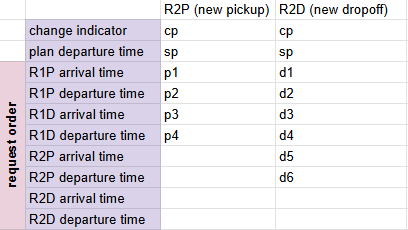

<!--
MIT License

Copyright (c) 2026 Czech Technical University in Prague

Permission is hereby granted, free of charge, to any person obtaining a copy
of this software and associated documentation files (the "Software"), to deal
in the Software without restriction, including without limitation the rights
to use, copy, modify, merge, publish, distribute, sublicense, and/or sell
copies of the Software, and to permit persons to whom the Software is
furnished to do so, subject to the following conditions:

The above copyright notice and this permission notice shall be included in all
copies or substantial portions of the Software.

THE SOFTWARE IS PROVIDED "AS IS", WITHOUT WARRANTY OF ANY KIND, EXPRESS OR
IMPLIED, INCLUDING BUT NOT LIMITED TO THE WARRANTIES OF MERCHANTABILITY,
FITNESS FOR A PARTICULAR PURPOSE AND NONINFRINGEMENT. IN NO EVENT SHALL THE
AUTHORS OR COPYRIGHT HOLDERS BE LIABLE FOR ANY CLAIM, DAMAGES OR OTHER
LIABILITY, WHETHER IN AN ACTION OF CONTRACT, TORT OR OTHERWISE, ARISING FROM,
OUT OF OR IN CONNECTION WITH THE SOFTWARE OR THE USE OR OTHER DEALINGS IN THE
SOFTWARE.-->
# Supported Compilers
This project uses C++ 20 features, therefore, compiler fully supporting C++ 20 is required.

# Dependencies
The following libraries are required:

- spdlog
- [csv2](https://github.com/p-ranav/csv2)
- nanoflann
- magic_enum
- boost-multi-index
- boost-algorithm
- indicators
- yaml-cpp
- HDF5 (including the C++ and the high-level API)
- RapidJSON
- future-config

All these can be installed via `vcpkg` with the following command:
```bash
vcpkg install spdlog p-ranav-csv2 nanoflann magic-enum boost-multi-index boost-algorithm indicators yaml-cpp "hdf5[cpp,hl]" rapidjson future-config
```

## Development version of future-config
The project can require a version of future-config that is not released in the `vcpkg` registry yet. In that case, `find_package` rejects the registry version, and the library has to be installed from a local clone of the [Future-Config repository](https://github.com/F-I-D-O/Future-Config), using the port that is part of that repository as an overlay port:
```bash
vcpkg install future-config --overlay-ports=<Future-Config repository>/cpp/port
```
The overlay port builds the library from the local repository, not from GitHub. If the registry version is already installed, remove it first with `vcpkg remove future-config`.


# Running the benchmark

The DARP benchmark program accepts the following command line arguments:

| Argument |  Description | Required | Default |
|----------|-------------|----------|---------|
| `--instance` | Path to the instance file (`.yaml` for DARP benchmark instances or classic instance files) | Yes | - |
| `--outdir` | Output directory for results | Yes | - |
| `--method` | Method for solving DARP (`ih`, `vga`, `vga_chaining`, `halns`) | Yes | - |
| `--tcount` | Number of executions for averaging | No | 1 |
| `--tmax` | Maximum number of threads for parallel regions | No | 0 (auto) |

Additionally, there are some parameters that are specific to the methods.

So far, only one method is included: Insertion Heuristic (IH).

- `--method ih`
- `ih.temporal_pruning_min_plan_length` - minimum existing plan length for IH temporal insertion-position pruning in YAML config. Default: 32. Set to 0 to disable pruning.


The objective of the benchmark is the weighted solution cost configured by the `cost` section of the instance `config.yaml` (travel time by default); see the section "Cost model" in [doc/SPECIFICATION.md](doc/SPECIFICATION.md).

## Usage Examples

```bash
# Basic usage with IH method
./DARP-benchmark --instance data/instances/example.yaml --outdir results/ --method ih
```

## Configuration File Support

You can also provide a local configuration file as the first positional argument (without `-` prefix). The configuration file should contain the same parameters as command line arguments in YAML format. Command line arguments override configuration file values.


## Supported Instance Types
Benchmark supports instnces as described in the [DARP instances project](https://github.com/aicenter/Ridesharing_DARP_instances).

Additionaly, classical instances by Cordeau and Laporte are supported.

For the travel time model it is essential to ensure that the triangle inequality holds. If you have doubts, you can use the `check_triangle_inequality` target to check the triangle inequality for your distance matrix.


# Extending the benchmark
There are two ways to extend the benchmark:

- **public extensions**: you can just develop inside the project and then create a pull request with your extension. This is the most straightforward way how to extend the benchmark.
- **private extensions**: If you need to develop in private, you can create a separate project and plug-in your private DARP solver at compile time.


## Plugging in your private DARP solver
Your private project need to be integrated in two places:
- in the `CMakeLists.txt` the project needs to be connected together
- in one of your `*.cpp` files, you need a static solver registration

### CMakeLists.txt configuration

First, you need to aquire the DARP benchmark source code. This can be automated with the `FetchContent` CMake module:

```cmake
FetchContent_Declare(
    DARP-benchmark
    GIT_REPOSITORY git@github.com:aicenter/DARP-benchmark.git
    DOWNLOAD_EXTRACT_TIMESTAMP ON
)

FetchContent_MakeAvailable(DARP-benchmark)
```

Then youu need to set up your target as library and add the DARP benchmark include directories to it:

```cmake
add_library(<name of your target> STATIC
	<your source files>
)
target_include_directories(<name of your target> PUBLIC
	${DARP-benchmark_SOURCE_DIR}
    <other include directories>
)

# the linking to DARP_benchmark_lib is optional. It enables shared compilation for the final executable, and presets the public includes. Without this, we need to a) list required units from DARP-benchmark in our target, and b) manually add the DARP-benchmark include and dependency includes to our target.
target_link_libraries(<name of your target> PRIVATE
	DARP_benchmark_lib 
)
```

The integration of your target is then achieve by linking the provided `external_solvers` target to your target:

```cmake
# Plugging into DARP-benchmark
target_link_libraries(external_solvers INTERFACE <name of your target>)
target_link_options(DARP-benchmark PRIVATE
  "/WHOLEARCHIVE:$<TARGET_FILE:<name of your target>>"
)
```

The `/WHOLEARCHIVE` link option is required to ensure that DARP benchmark won't discard your target just because it is not used from the `main` function of the benchmark.


### Static solver registration
The static registration can be anywhere and has the following form:
```cpp

#include <DARP_benchmark.h>
#include "your_solver.h"

namespace DARP {
struct Registrator {
	Registrator() {
		Default_solver_registry::get()
            .register_solver<YourSolver>("your_solver");
	}
};

static Registrator registrator;

}
```

Of course, any Structure can be used and you can register multiple solvers. The important part is calling the `register_solver` function of the `Default_solver_registry` singleton from a static object, so that it is called at the very beginning of the program, before the `main` function is called.


### Plugging in custom configuration
Sometimes, configuration needs to be extended, e.g., if we need new parameters for our solver. There are several steps needed to do that:

1. Create the file, e.g., in `data/my_config.yaml`
2. Set the `DARP_BENCHMARK_EXTERNAL_MAIN_CONFIG_FILE` variable in your `CMakeLists.txt` **before the `FetchContent`**:
    ```cmake
    set(DARP_BENCHMARK_EXTERNAL_MAIN_CONFIG_FILE "${CMAKE_CURRENT_SOURCE_DIR}/data/my_config.yaml" CACHE FILEPATH "Path to external config file" FORCE)
    ```
    - this makes the config builder to use this file side by side the default config file from DARP-benchmark project.


This is it. Now the new config file will be:

- automatically generated
- automatically copied to the DARP-benchmark build dir in `_deps`
- automatically registered

Note that still you need to copy the file manually for custom targets outside the DARP-benchmark build dir, e.g., custom test executables. You can use the `copy_master_config` cmake helper for that.


# Implementation

## Data Types
Defined in `aliases.h`

### Times
All times are in one second resolution.

| Name       | Description | Usage |Data type |
|------------|-------------|-------|----------|
| `time` | Specific time of day in seconds, representing times between 00:00:00 and 23:59:59. | `departure time`, `arrival time`, `min_time`, `max_time`, travel times (durations) | `uint_fast32_t` |
| `travel_time` | We expect that no travel will be longer than 18 heours, so we can use a 2 byte type | TODO | `uint_fast16_t` |
| `service_duration` | Duration of the pickup and drop off actions. It is expected to be between 0 and 1h. | `service_time` | `uint_fast16_t` |

###  Other
| Name       | Description | Usage |Data type |
|------------|-------------|-------|----------|
| `vehicle_capacity` | The number of persons that can be transported in the vehicle at the same time | `capacity` | `uint_fast8_t` |
| `request_index` | Index of a requests. It should be between 0 and requests count - 1. | `request_index` | `uint_fast32_t` |
| `index_in_plan` | we expect that each plan can be 24 hours long an that the average trip is at least 2 minutes long. that means 24 * 60 *  2  maximum requests and 24 * 60 = 1440 maximum actions. For that, we need a 2 byte type | `index_in_plan` | `uint_fast16_t` |


## Vehicle Plan Builders
For performance reasons, it is essential to prevent memory allocations when building vehicle plans. Therefore, instead of using vehicle plans directly, we use vehicle plan builders. These special structures enables fast adding and removing of actions when trying to find the best plan.

The base class for this purpose is [Vehicle_plan_builder.h](src/solver/Vehicle_plan_builder.h). Each specific solver is expected to inherit from this class  and use it's own customized builder implementation, as the requirements for the builder are different for each solver. However, some common functionality is implemented in the base class.

- `time_adjustments`: delays induced to actions by adding other actions to the plan


### Time Adjustments
This structure is used to store the delays induced to actions by adding other actions to the plan. The size of the structure depends on the solver, but the principle is the same for all solvers:

1. when a new action is added to the, we save a delay value for each action delayed as a result of adding the new action.
1. later, when we remove this action, we use the saved delay values to revert the plan builder to the state before the action was added.

The initial value for all fields in the time adjustments structure is 0. We can describe an example implementation of the time adjustments structure in the [vehicle plan builder for IH](src/solver/IH/IH_vehicle_plan_builder.h).

<p align="center">
    
</p>

Here, first column holds delay data for the pickup action of the new request, and the second column holds delay data for the drop off action of the new request. As Insertion Heuristic adds one request at a time, this is enough to store the delays. The meaning of the rows is:

- The indicators `cp` and `cd` are used to indicate whether the action caused any delay (`1`) or not (`0`).
- plan delays `sp` and `sd` shows delay in plan departure
- action delays `p1`,..., `p4` shows delays for existing actions in the plan cause by the new pickup action
- action delays `d1`,..., `d6` shows delays for existing actions in the plan cause by the new drop off action

These values are stored in a flat aray, for IH plan builder, the order is: `cp`, `sp`, `p1`,..., `pn`, `cd`, `sd`, `d1`,..., `dn`. The size is `$ 4 |p| - 6 + 4 = 4|p| - 2 $`, where `$ |p| $` is the number of actions in the plan, including the new action.

## Tests

### Chaning
There are two types of chaining tests: 
- tests validating individual components - *component tests*
    - variant generation tests
    - network generation tests
    - MCFP solver tests
- tests validating the whole chaining process - *chaining tests*

All tests are located in the `Chaining_test.cpp` file. The data structures for component tests are also in this file, but the data stractures for chaining tests are located in `src/solver/VGA_chaining/chaining/testing.h`, in oreder to be accessible from the chaining tester executable.

Each component test type (variant generation, network generation, MCFP solver) has it's own data structures that are the minimal implementations of the component interface. 


# Methodology

## Waiting times
In DARP, we the vehicle sometimes needs to wait to satisfy the time window constraints. It is not specified in the problem definition where exactly we should wait, i.e., we can wait at the action location, or we can wait at the previous location. All methods in this project follow the following strategy:

- departure time of the vehicle/plan is the latest possible so that the vehicle can make it to the min time of the first action (plan departure = first action arrival time - travle time to first action)
- all other times are minimized to minimize the passenger delay, even if it causes more waiting for the vehicle.


# Tests
Solver tests are designed to use declarative input files, instead of hardcoding the inputs into the test code. Unless the solver test only test some specific subproblems, the following data should be used:

- for input, the DARP instance, as specified in the [DARP instances project](https://github.com/aicenter/Ridesharing_DARP_instances), including:
    - `config.yaml`,
    - `requests.csv`,
    - `vehicles.csv`,
    - `dm.csv`
- for expected output, the solution serialized as a JSON file, again, as specified in the [DARP instances project](https://github.com/aicenter/Ridesharing_DARP_instances)

